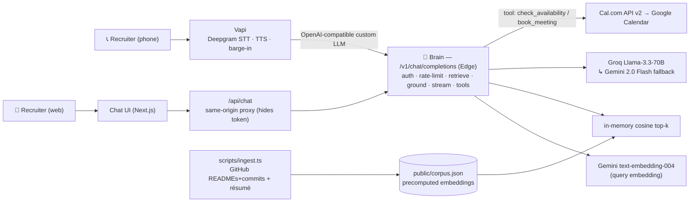

# AI Persona — call me, chat me, book me

A RAG-grounded AI representative of me that you can **call on the phone** or **chat with on the web**. It answers from my **real résumé and GitHub** (no hardcoded answers), stays honest under adversarial probing, and **books a real meeting** on my calendar with no human in the loop.

> **Live**
> - 💬 Chat: `https://<YOUR-APP>.vercel.app`
> - 📞 Voice: `<YOUR PHONE NUMBER>`

---

## Architecture

**One brain, two surfaces.** Voice and chat are thin clients over a single OpenAI-compatible, streaming Edge endpoint. Grounding is therefore *provably identical* across both, and measured once.



### How it works
- **RAG core.** `scripts/ingest.ts` pulls every public repo (metadata, **README**, **recent commits**, manifests, file tree) + the résumé PDF, chunks it, embeds it with Gemini `text-embedding-004`, and writes `public/corpus.json`. The corpus is small, so the brain does **brute-force cosine in memory** — no vector DB, no network hop in the hot path.
- **The brain** (`/api/v1/chat/completions`, Edge): authenticates → embeds the query → retrieves top-6 → builds a grounded, anti-injection system prompt → streams a Groq completion (Gemini fallback) → executes booking tools server-side and loops results back.
- **Honesty.** The system prompt forbids inventing facts and refuses prompt-injection/persona-break attempts; this is *measured* (see Evals).
- **Booking.** `book_meeting` / `check_availability` run server-side against Cal.com (wired to my real Google Calendar) — identical for voice and chat.

---

## Tech stack
TypeScript · Next.js (App Router, Edge runtime) on Vercel · Groq `llama-3.3-70b-versatile` (primary) + Gemini `2.0-flash` (fallback + eval judge) · Gemini `text-embedding-004` · Vapi (Deepgram STT + TTS) · Cal.com API v2 → Google Calendar · Vitest.

## Repo layout
```
src/lib/rag/        types · chunker · embeddings · in-memory retrieval · corpus loader
src/lib/llm/        Groq + Gemini streaming clients · generate() routing/fallback
src/lib/persona/    grounded system prompt · tool schemas · tool executor · tool-loop runner
src/lib/booking/    Cal.com v2 client
src/lib/ingest/     GitHub + résumé fetchers
src/lib/security/   bearer auth + rate limiting
src/lib/eval/       precision/recall · WER
src/app/api/v1/chat/completions/   the brain (Edge, OpenAI-compatible)
src/app/api/chat/   same-origin chat proxy
src/app/page.tsx    minimal streaming chat UI
scripts/ingest.ts   build corpus.json     scripts/eval.ts   eval harness → report
vapi/assistant.json voice config-as-code  evals/            golden/adversarial sets, narrative
```

---

## Setup

```bash
npm install
cp .env.example .env        # fill in the keys below
```

| Env var | Purpose |
|---|---|
| `GITHUB_USERNAME`, `GITHUB_TOKEN` | repo ingestion (PAT, `public_repo`) |
| `CANDIDATE_NAME` | name used in the persona prompt |
| `GROQ_API_KEY` | primary LLM |
| `GEMINI_API_KEY` | embeddings + fallback LLM + eval judge |
| `BRAIN_API_TOKEN` | bearer shared by Vapi + chat proxy |
| `CALCOM_API_KEY`, `CALCOM_EVENT_TYPE_ID` | booking; `CALCOM_TIMEZONE` optional |
| `APP_BASE_URL` | deployed base URL (eval harness) |

### 1. Ingest your corpus
```bash
npm run ingest      # → public/corpus.json  (commit it)
```

### 2. Run / deploy
```bash
npm run dev         # local
npx vercel --prod   # deploy; set the same env vars in the Vercel project
```

### 3. Voice (Vapi)
Create an assistant from `vapi/assistant.json` (replace name + app URL). In the
custom-LLM credential, paste `BRAIN_API_TOKEN` as the API key (or append
`&key=<BRAIN_API_TOKEN>` to the URL). Attach a phone number. Done.

### 4. Booking (Cal.com)
Connect Google Calendar in Cal.com, create a 30-min event type, set
`CALCOM_EVENT_TYPE_ID` + `CALCOM_API_KEY`.

### 5. Evals
```bash
# edit evals/golden.json with real repo/résumé facts first (see evals/README.md)
npm run eval        # → evals/metrics.json + evals/report.html → print to 1-page PDF
```

---

## Cost breakdown

| Item | Unit cost | Notes |
|---|---|---|
| **Chat session** (~6 turns) | **$0.005–0.02** | Groq tokens; Gemini embeddings on free tier |
| **Voice call** (~3 min) | **$0.20–0.40** | Vapi platform + Deepgram STT + TTS; Groq cheap |
| Phone number | ~$2 / mo | Twilio US (or free Vapi number) |
| Vercel · Cal.com · Groq · Gemini | $0 | free tiers |

A full 7-day grading window (~10 calls + ~50 chats) lands **well under $20**, with Vapi's free trial credit absorbing most of the voice cost.

## Tradeoffs & roadmap
Key conscious tradeoff: **in-memory cosine + Groq-70B** over a managed vector DB +
frontier model — chosen for `<2s` voice latency and `<$20` cost, accepting a recall
ceiling that only matters at much larger corpus sizes. Full reasoning, measured
hallucination rate, retrieval P/R, 3 failure modes, and the 2-week roadmap are in the
**eval report** (`npm run eval`).
