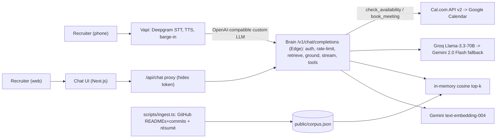

# Architecture (diagram source)

The canonical diagram lives in the README. This file is the editable source.

## Request path (voice turn)
1. Caller speaks → Vapi (Deepgram) transcribes.
2. Vapi POSTs OpenAI-compatible `/v1/chat/completions?mode=voice` to the brain.
3. Brain: auth + rate-limit → embed query (Gemini) → cosine top-6 over in-memory corpus
   → grounded+anti-injection system prompt → stream Groq (Gemini fallback).
4. If the model calls a tool, the brain runs Cal.com server-side and loops the result back.
5. Brain streams OpenAI SSE chunks → Vapi (TTS) → caller. Target first token `<2s`.
